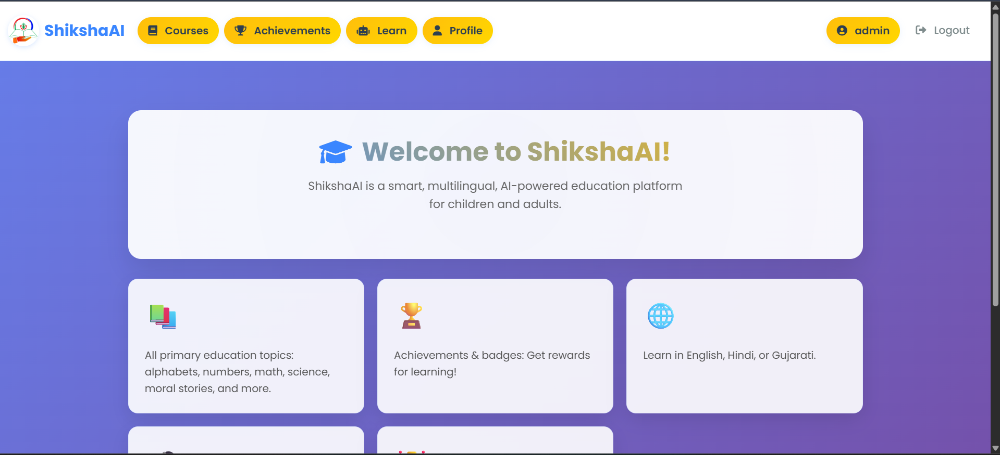
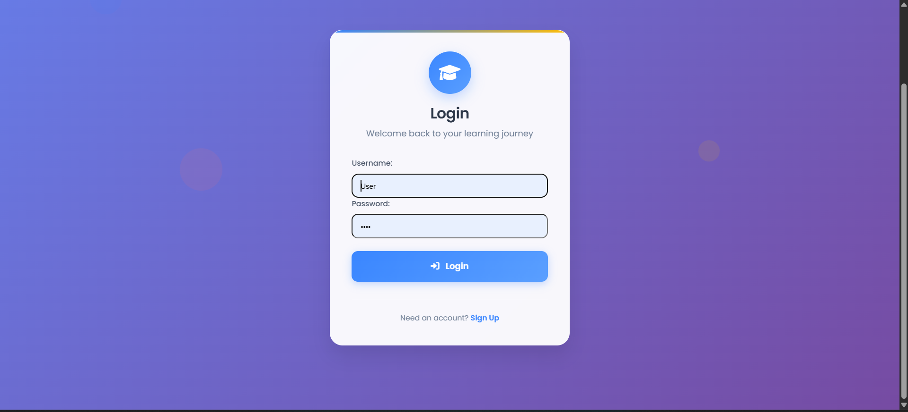
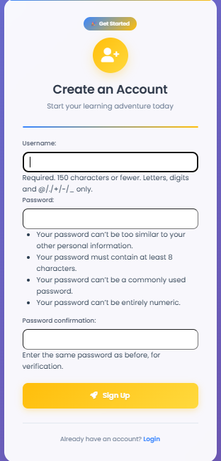
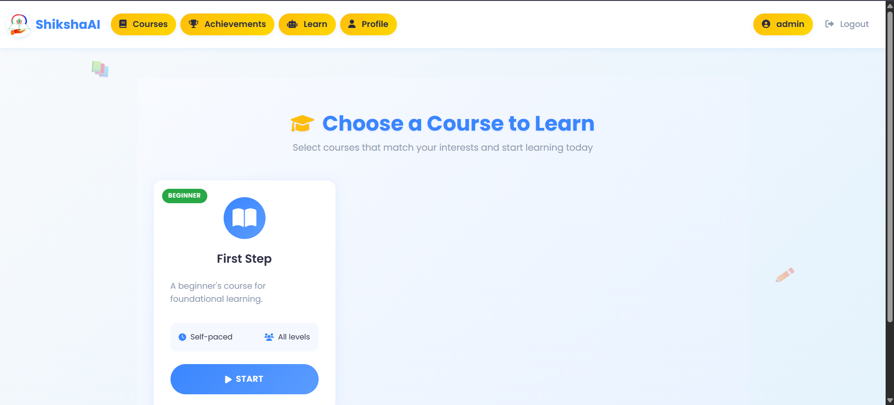
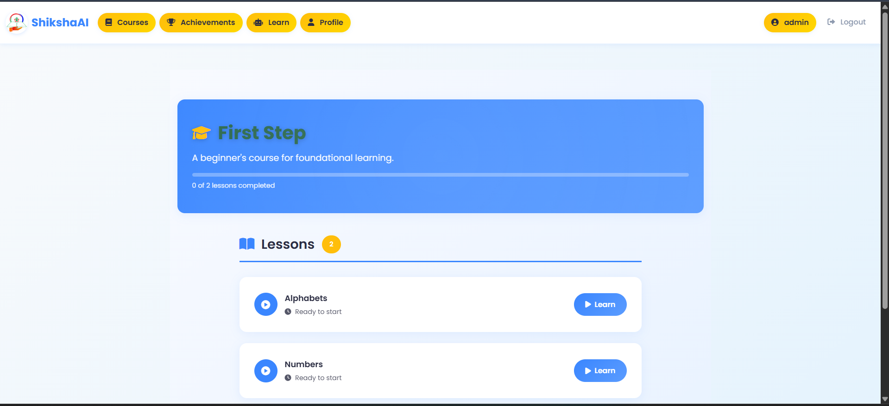
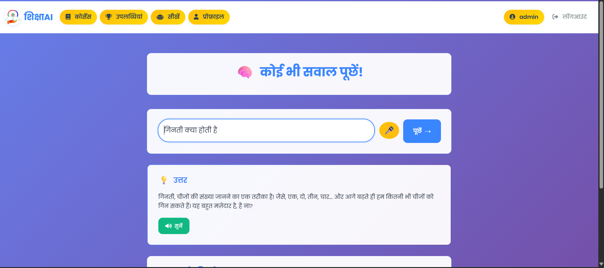
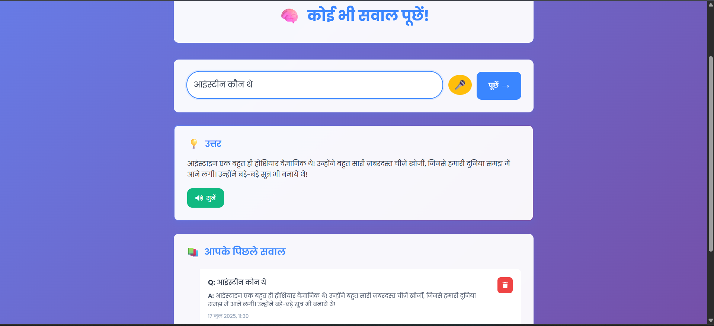

# 🎓 Shiksha AI – Learn with Voice. Grow with Language.

**Shiksha AI** is a multilingual, voice-powered educational platform designed for students aged 10–18. Built using Django and powered by AI (Gemini), it enables students to learn through **spoken questions**, **native language content**, and **interactive lessons**, all aligned with **UN Sustainable Development Goal 4 – Quality Education**.

---

## 🚀 Live Demo

🌐 **[Click here to try Shiksha AI](https://shiksha-ai.onrender.com)**  
📱 100% mobile-friendly and responsive!

---

## ✨ Features

- Voice-based Q&A in Hindi and English  
- Language selector with dynamic UI updates  
- Text-to-speech for all lesson content and AI replies  
- Structured courses and lessons with progress tracking  
- Achievements and gamified learning badges  
- AI assistant embedded in every lesson page  
- View and delete chat history per lesson  
- Secure login/logout with CSRF protection  
- WhiteNoise static file handling for production  
- Colorful, accessible, child-friendly UI/UX  

---

## 📸 Screenshots

> _Replace the links below with your actual screenshot URLs_

### 🔐 Login & Language Selection  

### 📚 Courses Dashboard  

### 🧠 Ask AI Using Mic  

### 🏆 Achievements & History  

---

## 🎯 Aligned With: SDG Goal 4 – Quality Education

Shiksha AI helps bring inclusive and equitable education to students aged 10–18 using AI, voice interaction, and native language support — making learning accessible to every child, regardless of geography or literacy level.

---

## 🧑‍🎓 Ideal Users

- Students aged 10–18  
- Rural learners without access to tutors  
- NGO and government schools  
- Children who prefer native-language education  

---

## 🧑‍💻 Contributing

Pull requests are welcome! Feel free to fork this project, improve it, and submit PRs. If you’d like to collaborate or contribute as part of an NGO or CSR initiative, reach out.

---

## 📄 License

MIT License © 2025

---

> ⭐ **Give this repo a star** if you support AI + voice-based education for all!
